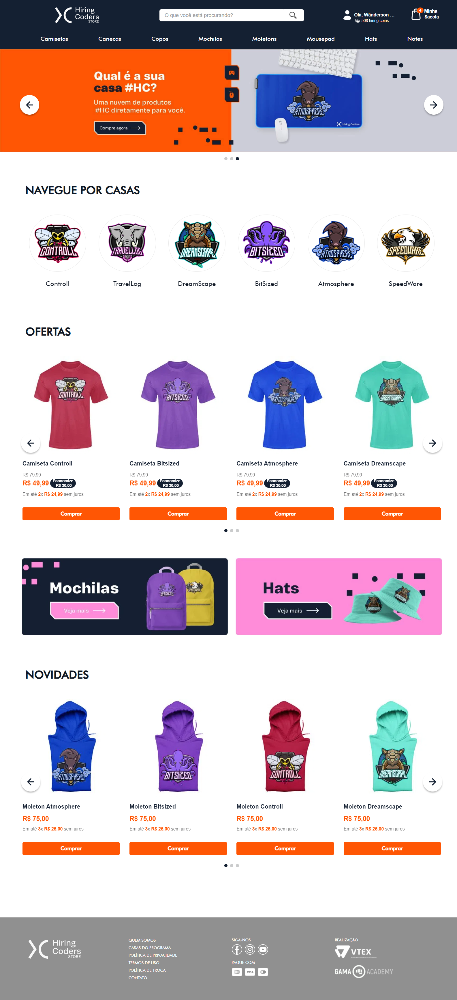

<h1 align="center">
    Bee in Controll Store Theme 🐝
</h1>

## 🔎 Tabela de conteúdos

* [Sobre o Projeto](#📝-Sobre-o-projeto)
    * [Concepção](#📌-Concepção-da-Bee-in-Controll)
    * [Construção](#📌-Construção)
    * [Catálogo](#📌-Construção-do-layout)
    * [sadsadasd](#📌-Catálogo-de-produto)
* [Tecnologias e Ferramentas](#🔧-Tecnologias-e-Ferramentas)
* [Executando](#🔨-Executando)
* [Back-End](#💻-Back-End)
* [Desenvolvido Por](#💪🏻-Desenvolvido-por)
* [Atribuições](#👥-Atribuições)
* [Preview](##-👓-Preview)

#
## 📝 Sobre o Projeto

### 📌 **Concepção da Bee in Controll**

 - A concepção do nome da loja Bee In Controll surgiu a partir de um trocadinho entre o nome Controll (casa designada a nosso grupo do Hiring Coders #3) e o abelha, animal que representa casa. Dito isto, buscamos construir uma identidade visual compatível com um grupo etário de jovens adultos que vem em sua vestimenta uma forma de expressar quem são e como gostariam de ser vistos pelo ambiente que os cercam.

> A Bee In Controll nasceu inspirada no incrível poder de transformação, criatividade e união das abelhas.
>E pensando nisso, queremos te incentivar a unir-se a nós para se libertar dos padrões, usando sua criatividade como meio da transformação para assim assumir o controle do seu estilo.
>Nossa missão é trazer liberdade através de roupas divertidas e criativas, feitas especialmente para adoçar sua vida. E antes que você se pergunte, não usamos mel na fabricação de nossas peças, haha.
>Acreditamos que estilo não é seguir tendências, mas sim um poder capaz de expressar um pouco da sua personalidade e da sua essência, vestindo o que te faz sentir bem e confortável. Então, por favor, vista-se de você!!
---
### 📌 **Construção**

#### **O Front-End Possui:**

- Header com Menus: todos habilitados
    * Banners com CTA
    * Carousel com coleções exclusivas
    * Cards com CTA
    *Carousel com marcas com link direcionável
- Footer: 
    - Páginas específicas do site: Sobre Nós, Política de Privacidade, Termo de Uso, Política de Troca e Fale Conosco; 
    - Links de Redes Sociais da Loja Bee In Controll: Facebook, Instagram e Youtube.
- Página Search
- Página de Produto
- Página Sobre Nós
- Página Fale Conosco: imagens clicáveis que redirecionam para as respectivas páginas e um app costumizado para o formulário.
- Página Política de Privacidade
- Página Política de Troca
- Página Termos de Uso
---
### 📌 **Construção do Layout**


---
#### 📌 **Catálogo de Produto**


- Metodologia ágil: Kanban

#
## 🔧 Tecnologias e Ferramentas

As seguintes tecnologias/ferramentas foram usadas na construção do projeto:

- Layout: **Figma** (consulte o Layout [aqui](https://www.figma.com/file/BhAeyEwi0T6o5koquYqDQu/HC-Final-Bee-In-Control))
- Ferramenta de Controle: **Trello** (consulte [aqui](https://trello.com/invite/b/VbvHD6lF/bfb09d3906c305da45a50b58596367a4/controll-final-hc/))
- Armazenamento de arquivos: **Google Drive** (consulte [aqui](https://drive.google.com/drive/folders/1Y9ZXOOvD85fpLGHDKMcNzSFZE4bm_ZoB))
- Comunicação: Alinhamentos no **Gather**; **Slack** e **WhatsApp**
- **VTEX IO**
- **Java**
- **React**
- **Typescript**
- **EC2**
- **S3**
#
## 🔨 Executando

```
- vtex login controll
- vtex use beein 
- vtex link
```
#

## 💻 Back-End

#
## 💪🏻 Desenvolvido por

- [Alessandra Buzios](https://www.linkedin.com/in/alessandra-buzios/)
- [Allysson Fernando](https://www.linkedin.com/in/allyssonalmeida/)         
- [Andressa Santana](https://www.linkedin.com/mwlite/in/andressa-santana-9a9431236)             
- [Cristiane dos Santos Costa](https://www.linkedin.com/in/cristianedsc/)
- [Douglas Rodrigues](https://www.linkedin.com/in/douglas-rodrigues-pnz/)
- [Fernando Beça](https://www.linkedin.com/in/fernando-beca/)
- [Igor Santos](https://www.linkedin.com/in/igor-santos-5740b3116/)
- [Leona Evangelista](https://www.linkedin.com/in/leona-evangelista/)
- [Rômulo Rosa](https://www.linkedin.com/in/romulofrontend/)
- [Suélen Dias](https://www.linkedin.com/in/su%C3%A9len-dias-palhares-2aa47573/)

#
## 👥 Atribuições

- **Squad Leader**: Suélen Dias
- **UI/UX**: Alessandra Buzios; Igor Santos
- **Mockups**: Igor Santos
- **Back-end**: Douglas Rodrigues
- **Front-end**: Allysson Fernando; Cristiane dos Santos Costa; Leona Evangelista; Rômulo Rosa; Douglas Rodrigues; Suélen Dias
- **Admin Loja Vtex**: Suélen Dias, Fernando Beça, Andressa Santana
- **Marketing**: Cristiane dos Santos Costa; Leona Evangelista e Alessandra
- **Documentação**: Suélen Dias; Leona Evangelista

#
## 📸 Preview


